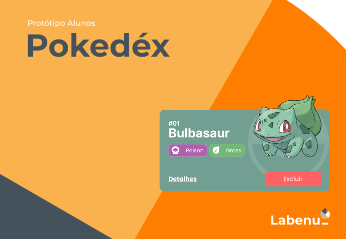

# E-commerce LABECOMMERCE

Link para
[FIGMA](https://www.figma.com/file/KseyA2Ofghiek2Cy3ZaDre/Poked%C3%A9x?type=design&node-id=0%3A1&mode=design&t=5ZjxPbejr27cDnzo-1)

 
 

# Sumário
<!--ts-->
   * [Sobre](#Sobre)
   * [Etapa de Construção](#etapa-de-construção)
   * [Tecnologias](#tecnologias)
   * [Hospedagem](#hospedagem)
   * [Licença](#licença)

<!--te-->
 
 

# Sobre
O Projeto React e APIs é uma iniciativa que utiliza a Poke API como fonte de dados. Nesse projeto há três páginas principais: Home, Pokedex e Detalhes.
O objetivo principal desse projeto é aplicar os conhecimentos aprofundados de React como componentização, gerenciamento de estado, roteamento e consumo de APIs.
 
 

# Etapa de Construção
### Componentes de interface

-  Componente Header
-  Componente Modal
-  Componente PokemonCard

### Páginas do Site
- Página Home (PokemonListPage)
- Página da Pokédex (PokedexPage)
- Página do Detalhes do Pokémon (PokemonDetailPage)

## Página Home:
   - Mostrar uma lista de Pokemons, contendo ao menos 20 Pokemons;

   - Cada Pokemon será representado por um Card;

   - Em cada card de Pokemon tem um botão para adicioná-lo à Pokedex e um outro botão para acessar os detalhes do Pokemon; 

   - Header dessa página terá um botão para acessar a página da Pokedex;

## Página Pokédex
   - Renderizar a lista de pokémons adicionados na pokedex;

   - Em cada card de Pokemon deve ter um botão para removê-lo da Pokedex e um outro botão para acessar os detalhes do Pokemon;

   - Header deve ter um botão para voltar para a Home;

   - Não deve ser possível adicionar o mesmo Pokemon duas vezes na Pokedex;

## Página de Detalhes
   - Mostrar os detalhes do Pokemon selecionado, com informações descritas

   - Header deve ter um botão para adicionar ou remover da Pokedex e outro para voltar a página home.

   - Utilizar um Componets do Chakra UI (Progress)
         

[Projects do Github - LABECOMMERCE](https://github.com/users/MiaAntunes/projects/6/views/2)
 
 
 

# Tecnologias
  - React.JS
     - Router
     - Styled Components
     - Custom Hook
     - Hooks
     - Vite
     - Chakra UI
     - Axio
 - Postman

 
 
 

# Hospedagem
[Hospedagem](https://pokemonmypokedex.surge.sh/)
 
 
 

# Licença
